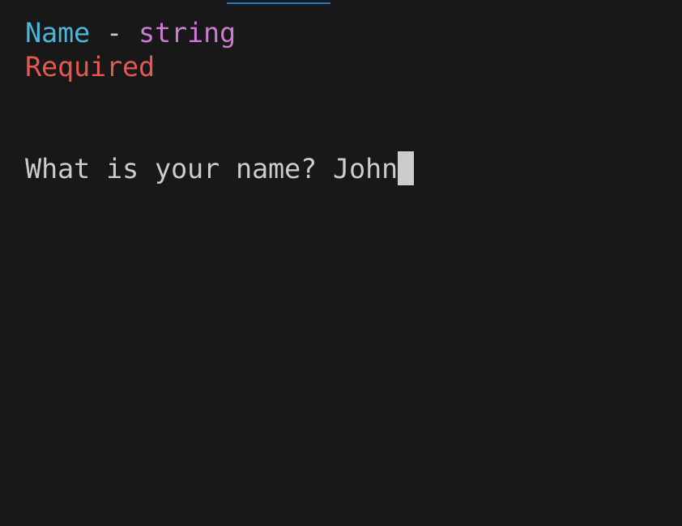
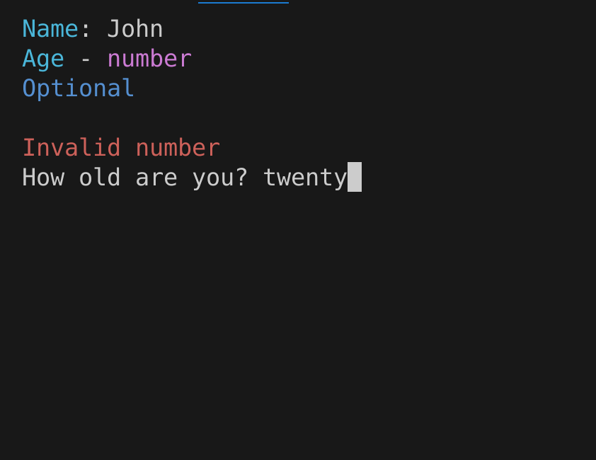
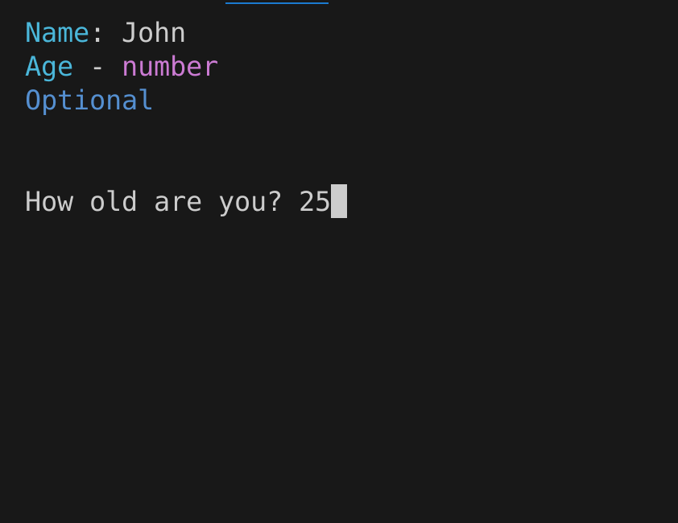
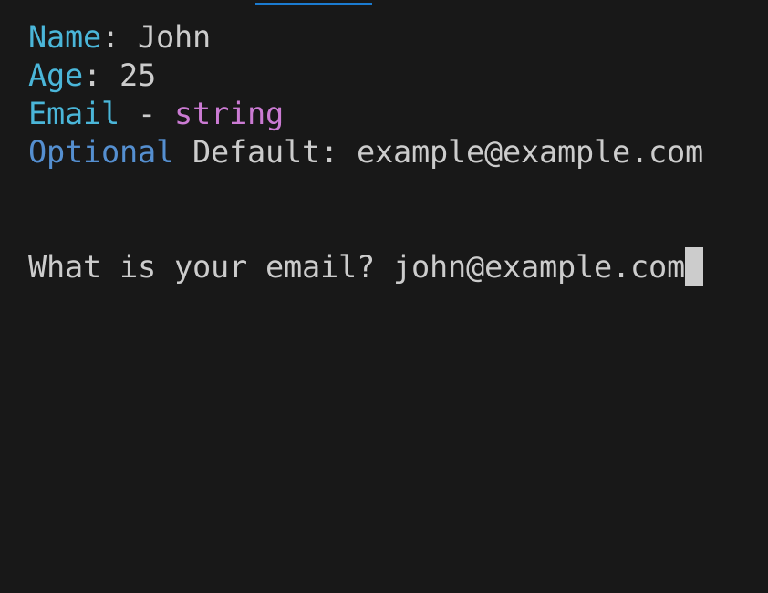
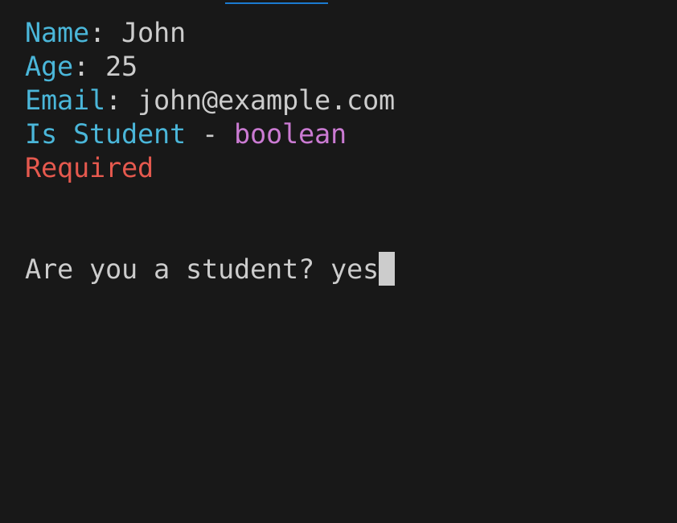
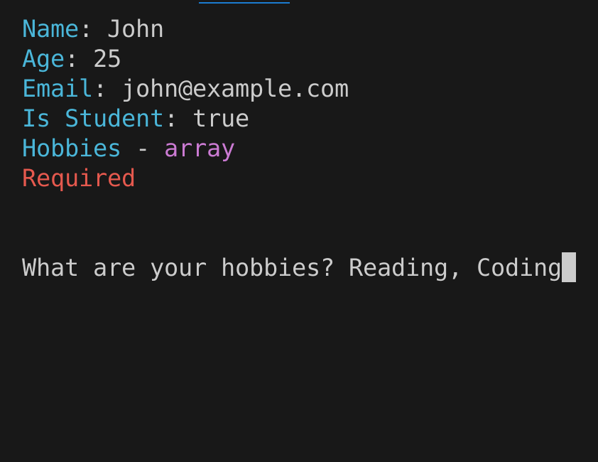

# Easy CLI

A CLI library for Deno that allows you to create an interactive CLI application
with ease.

## Installation

```bash
deno add @eveffer/easy-cli
```

## Usage

### EasyCLI

```typescript
import { EasyCLI } from "@eveffer/easy-cli";

const easyCli = new EasyCli("My CLI App");

easyCli.addMenuItem({
  title: "Sample Menu Item",
  description: "This is a sample menu item",
  action: () => {
    console.log("This is a sample action");
  },
  waitAfterAction: true,
});

easyCli.addMenuItem({
  title: "Another Menu Item",
  description: "This is another sample menu item",
  action: () => {
    console.log("This is another sample action");
  },
});

if (import.meta.main) {
  easyCli.run();
}
```

### TypedObjectPrompter

```typescript
import { EasyCLI } from "@eveffer/easy-cli";

const prompter = new TypedObjectPrompter({
  fields: [
    {
      key: "name",
      message: "What is your name?",
      type: "string",
      required: true,
    },
    {
      key: "age",
      message: "How old are you?",
      type: "number",
    },
    {
      key: "email",
      message: "What is your email?",
      type: "string",
      defaultValue: "example@example.com",
    },
    {
      key: "isStudent",
      message: "Are you a student?",
      type: "boolean",
      required: true,
    },
    {
      key: "hobbies",
      message: "What are your hobbies?",
      type: "array",
      required: true,
    },
  ],
});

const response = await prompter.prompt();

console.log(response);
```

This will prompt the user with the following questions:

<span>

</span>
<span>

</span>
<span>

</span>
<span>

</span>
<span>

</span>
<span>

</span>

And the response will be:

```json
{
  "name": "John",
  "age": 25,
  "email": "john@example.com",
  "isStudent": true,
  "hobbies": ["Reading", "Coding"]
}
```

### ObjectPrompter

### OptionSelector
